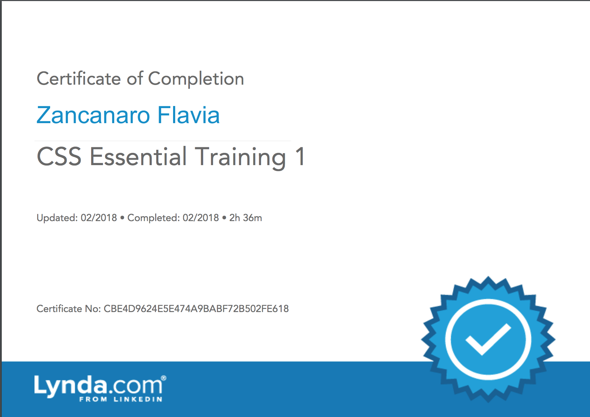

Topics include:
    * Creating a CSS file
    * Writing basic selectors
    * Setting properties
    * Using different typefaces and web-safe fonts
    * Understanding cascading and inheritance
    * Setting a font family, font size, text color, and more
    * Understanding the box model
    * Using the float property
